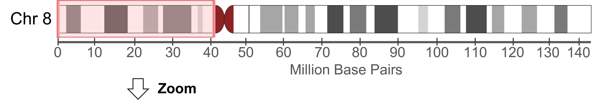
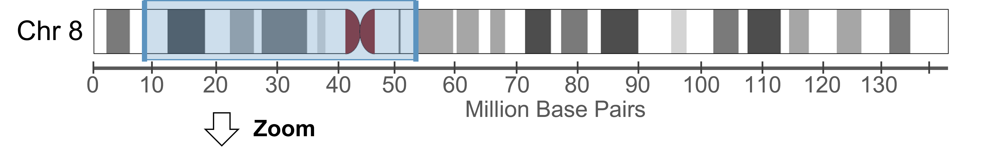
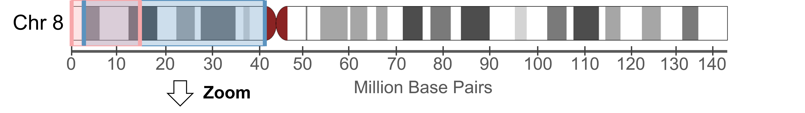
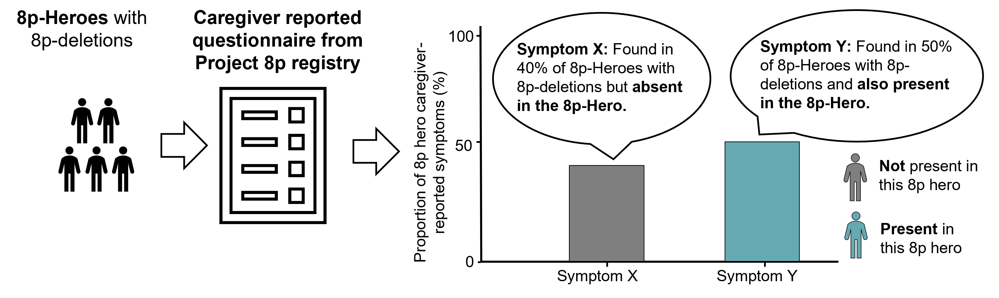

```{r setup and prepare input, include = F, results='asis'}

knitr::opts_chunk$set(echo = TRUE)

library(tidyverse)
library(knitr)
library(viridis)
library(grDevices)
library(ggstar)
library(cowplot)

#Initialize function to prepare LAtex code ### 

# Replaces special characters in a string with their R/LaTeX-safe equivalents.
sanitize <- function(string) {
  # Define special characters and their R/LaTeX-safe replacements
  special_chars <- c("\\#", "\\$", "\\%", "\\&", "\\_", "\\{", "\\}", "\\~", "\\^", "\\/")
  replacements <- c("\\\\#", "\\\\$", "\\\\%", "\\\\&", "\\\\_", "\\\\{", "\\\\}", "\\\\~{}", "\\\\^{}", "\\\\/")
  
  # Replace each special character with its corresponding replacement
  stringr::str_replace_all(string, setNames(replacements, special_chars))
}


# Calculates the median and interquartile range (25th and 75th percentiles) of a numeric vector.
summarize_vector <- function(vector, unit) {
  # Remove NA values from the vector.
  vector_sel <- na.omit(vector)
  # Calculate the median and quantiles.
  median_val <- median(vector_sel)
  q1 <- quantile(vector_sel, 0.25)
  q3 <- quantile(vector_sel, 0.75)
  # Format and return the result.
  sprintf("%s (%s - %s)", median_val, q1, q3)
}

# Convert Centimeters to Inches
cv_length <- function(x) {
  x <- as.numeric(x)
  if (is.na(x)) "" else round(x / 2.54, 1)
}

# Computes the median and interquartile range of a numeric vector and provides both cm and inch representations.
summarize_vector_len <- function(vector, unit) {
  # Remove NA values
  vector_sel <- vector[!is.na(vector)]
  
  # Median and interquartile range
  median_val <- round(median(vector_sel),1)
  q1 <- round(quantile(vector_sel, 0.25),1)
  q3 <- round(quantile(vector_sel, 0.75),1)
  
  # Convert values from cm to inches using cv_length.
  median_val_in <- cv_length(median_val)
  q1_in <- cv_length(q1)
  q3_in <- cv_length(q3)
  
  # Output string with LaTeX line break
  paste0(
    "\\makecell{",
    median_val, " cm (", q1, " cm - ", q3, " cm)", 
    "\\\\",
    median_val_in, " inch (", q1_in, " inch - ", q3_in, " inch)}"
  )
}

# Computes the percentage of entries in a vector that are "Yes" compared to "No", ignoring "Unknown" values.
get_frac <- function(vec) {
  vec <- vec[vec != "Unknown"]
  # Calculate percentage and sanitize the result.
  sanitize(sprintf("%s%%", round(sum(vec == "Yes") / length(vec) * 100, 1)))
}

# Determines the percentage of "Yes" responses in an age group, handling incomplete data.
get_frac_age <- function(age_assesment, vec) {
  # Check if the age of assessment is missing.
  if (is.na(df_par$`Age of Assesment Diagnostic History (years)`)) {
    return(list("Survey not complete", 101))
  }
  # Filter out "Unknown" responses.
  vec_sel <- vec[vec != "Unknown"]
  if (length(vec_sel) < 3) {
    return(list("Comparison group too small", 101))
  }
  frac <- round(sum(vec_sel == "Yes") / length(vec_sel) * 100, 1)
  list(sanitize(sprintf("%s%%", frac)), round(frac, 0))
}

# Returns "Survey incomplete" if the survey is incomplete and the value is non-missing or marked "Unknown".
check_completion <- function(value, status) {
  value <- ifelse(is.na(value),"Unknown",value)
  if (!status && (stringr::str_detect(value, "Unknown"))) {
    "Survey incomplete"
  } else {
    value
  }
}

# Returns "Survey incomplete" for incomplete surveys and converts "Yes"/"No" to "Present"/"Absent".
check_completion_clinic <- function(value, status) {
    value <- ifelse(is.na(value),"Unknown",value)
  value_int <- if (!status && (stringr::str_detect(value, "Unknown"))) {
    "Survey incomplete"
  } else {
    value
  }
  dplyr::case_when(
    value_int == "No" ~ "Absent",
    value_int == "Yes" ~ "Present",
    TRUE ~ value_int
  )
}

# Determine Table Cell Color Based on Response
color_cell <- function(indi_value, other_value) {
  # Generate a color palette with 101 entries.
  palette <- c(colorRampPalette(c("white", "#01707e"))(100), "FFFFFF")
  # Remove any leading '#' from the palette entries.
  palette <- sub("^#", "", palette)
  if (!stringr::str_detect(indi_value, "Present")) {
    palette[101]
  } else {
    palette[ifelse(other_value == 101, 101, other_value + 1)]
  }
}

# Initialize a vector to store color definitions
color_definitions <- c()

# Constructs a LaTeX-formatted table row for a given variable, including cell colors, for the clinical values. 
generate_row <- function(variable_name, diag_status) {
  # Sanitize variable name for use in LaTeX color definitions.
  sanitized_var_name <- gsub("[^a-zA-Z0-9]", "_", variable_name)
  indi_value <- check_completion_clinic(df_par[[variable_name]], diag_status)
  frac_result <- get_frac_age(df_other$`Age of Assesment Diagnostic History (years)`, df_other[[variable_name]])
  other_value <- frac_result[[1]]
  color_value <- frac_result[[2]]
  
  # Update global color definitions with new LaTeX color commands.
  color_definitions <<- c(
    color_definitions,
    sprintf('\\definecolor{%s_color_indi}{HTML}{%s}', sanitized_var_name, color_cell(indi_value, color_value)),
    sprintf('\\definecolor{%s_color_other}{HTML}{%s}', sanitized_var_name, color_cell("Present", color_value))
  )
  
  # Append an asterisk for specific variable names.
  if (variable_name %in% c("Microcephaly", "Micrognathia very small lower jaw")) {
    variable_name <- paste0(variable_name, "*")
  }
  
  sprintf("%s & \\Block[fill=%s_color_indi]{1-1}{%s} & \\Block[fill=%s_color_other]{1-1}{%s} \\\\ \\hline",
          variable_name, sanitized_var_name, indi_value, sanitized_var_name, other_value)
}

# Determines the status of a developmental milestone based on survey completion and response.
get_milestone_indi <- function(df_par, m_status, mile_sel) {
  df_par %>%
    dplyr::mutate(result = dplyr::case_when(
      .data[[mile_sel]] == "Unknown" & m_status == "Complete" ~ "Unknown",
      .data[[mile_sel]] == "Unknown" & m_status != "Complete" ~ "Survey incomplete",
      .data[[mile_sel]] == "Not yet" ~ "Not achieved",
      TRUE ~ as.character(.data[[mile_sel]])
    )) %>%
    dplyr::pull(result)
}


# Computes the percentage of participants achieving a milestone by a specific age.
get_milestone_frac <- function(df_1, df_all, age_assesment, age_milestone) {
  if (is.na(df_1[[age_assesment]])) {
    return("Survey incomplete")
  }
  
  # Determine milestone age, substituting assessment age if milestone is missing.
  age_par <- ifelse(is.na(df_1[[age_milestone]]) || df_1[[age_milestone]] == 9999,
                    df_1[[age_assesment]] * 12,
                    df_1[[age_milestone]])
  
  # Filter the comparison group to valid entries.
  participats <- df_all %>%
    dplyr::filter(!is.na(.data[[age_milestone]]),
                  !(.data[[age_milestone]] == 9999 & df_all[[age_assesment]] * 12 <= age_par))
  
  frac <- round(sum(participats[[age_milestone]] <= age_par) / nrow(participats) * 100, 1)
  list(sanitize(sprintf("%s%%", frac)), frac)
}


# Parses genomic coordinate strings and extracts numeric positions.
get_genom_coord <- function(df_mod) {
  x <- unlist(df_mod[, 1])
  y <- unlist(df_mod[, 2])
  
  # Identify indices with a parenthesis in the strings.
  common_indices <- intersect(which(stringr::str_detect(x, "\\(")), which(stringr::str_detect(y, "\\(")))
  if (length(common_indices) == 0) return(NA)
  
  x_selected <- x[common_indices]
  # Remove non-numeric characters and convert to numeric.
  as.numeric(gsub("[^0-9\\.]", "", sub(".*\\(", "", x_selected)))
}

# Wraps a long string into multiple lines, replacing "&" with "and" and inserting LaTeX line breaks.
introduce_table_breaks <- function(input_string, max_length = 30) {
  formatted_string <- gsub("&", "and", input_string)
  wrapped <- stringr::str_wrap(formatted_string, width = max_length)
  sprintf("\\makecell{%s}", gsub("\n", " \\\\ ", wrapped))
}

# convert birth weight to lbs 
convert_weight <- function(x){
  
  case_when(x == "2500-4000 g"~ "\n(5.5-8.8 lbs)",
            x == "1500-2499" ~"\n(3.3-5.5 lbs)",
            x == "1001-1499" ~"\n(2.2-3.3 lbs)",
            x == ">4000 g" ~"\n(>8.8 lbs)",
            T~"") %>% 
    return()
  
}

# Format genetic boundaries inside brackets with thousand separators
format_brackets <- function(strings) {
  # Regular expression to match numbers inside parentheses
  pattern <- "(?<=\\()\\d+(?=\\))"
  
  # Apply formatting
  formatted_strings <- sapply(strings, function(x) {
    if (str_detect(x, pattern)) {
      x <- str_replace_all(x, pattern, function(y) format(as.numeric(y), big.mark = ",", scientific = FALSE))
    }
    return(x)
  })
  
  return(formatted_strings)
}

#start processing the data #### 

df <- read_delim(params$hero_data ,delim = "\t") 

i <- params$i
df_par <- df[params$i,]

df_background <- read_delim(params$reference_data ,delim = "\t")

# Suggested name changes 
df_par <- df_par %>% 
  dplyr::rename("Days at the Hospital following NICU Admission" = "Hospital (days)",
                "Motor skills difficulties" = "Motor skills difficulties no ability to move",
                "Unusual response to taste (e.g. higher or lower response to stimuli than would be expected, or a lack of discrimination)" = "Unusual response to taste",
                "Unusual response to sounds (e.g. startle response to sounds or lack of response to sounds)" = "Unusual response to sounds (ever)",
                "Unusual response to touch (e.g. higher or lower pain tolerance)" = "Unusual response to touch",
                "Repetitive behaviors or gestures such as hand flapping or rocking" = "Repetitive behaviors such as hand flapping or rocking",
                "Abnormally active or aggressive" = "Behavior problems abnormally active/hyperactive",
                "Does not point/make meaningful gestures or imitate" = "Did not point/make meaningful gestures or imitate", 
                "Does not initiate or rarely initiates social interaction" = "Did not initiate or rarely initiated social interaction",
                "Overly focused on objects or self minimal interest"= "More focused on objects or self minimal interest" )


# Determine genetic subgroup to identify control cohort 
genetic_sub <- df_par$`Group broad`[1]
genetic_sub_detailed <- ifelse(genetic_sub == "8p deletion" & df_par$`Group detailed`[1] %in% c("8p deletion distal ","8p deletion proximal ","8p deletion proximal & distal "),df_par$`Group detailed`, genetic_sub)
df_other <- df_background[which(df_background$`Group broad` == genetic_sub),]

df_other <- df_other %>% 
  dplyr::rename("Days at the Hospital following NICU Admission" = "Hospital (days)",
                "Motor skills difficulties" = "Motor skills difficulties no ability to move",
                "Unusual response to taste (e.g. higher or lower response to stimuli than would be expected, or a lack of discrimination)" = "Unusual response to taste",
                "Unusual response to sounds (e.g. startle response to sounds or lack of response to sounds)" = "Unusual response to sounds (ever)",
                "Unusual response to touch (e.g. higher or lower pain tolerance)" = "Unusual response to touch",
                "Repetitive behaviors or gestures such as hand flapping or rocking" = "Repetitive behaviors such as hand flapping or rocking",
                "Abnormally active or aggressive" = "Behavior problems abnormally active/hyperactive",
                "Does not point/make meaningful gestures or imitate" = "Did not point/make meaningful gestures or imitate", 
                "Does not initiate or rarely initiates social interaction" = "Did not initiate or rarely initiated social interaction",
                "Overly focused on objects or self minimal interest"= "More focused on objects or self minimal interest" )


# create readouts of individual and groups when appropriate 
# General info ####
DoT <- ifelse(df$`Test date`[i] != "Unknown", format(as.Date(df$`Test date`[i], format = "%m/%d/%Y"), "%Y-%B-%d"), "Unknown")
lab_test <- "something"
testype <- df$`Test type`[i]

# Genetic finding 
genetic_finding <- paste0(genetic_sub_detailed," (")
if(genetic_sub %in% c("8p deletion", "8p inverted duplication/deletion") & (df$`Deletion start`[i] != "Unknown" | df$`Deletion end`[i] != "Unknown")){
  
  genetic_finding <- str_replace(genetic_finding, "duplication/deletion", "duplication deletion")
  
  genetic_finding <- paste0(genetic_finding, "8p deletion: ", format_brackets(df$`Deletion start`[i]), " to ", format_brackets(df$`Deletion end`[i]))
}
if(genetic_sub %in% c("8p duplication", "8p inverted duplication/deletion") & (df$`Deletion start`[i] != "Unknown" | df$`Deletion end`[i] != "Unknown")){
  if(nchar(genetic_finding) < 45){
    genetic_finding <- paste0(genetic_finding, "8p duplication: ", format_brackets(df$`Duplication start`[i]), " to ", format_brackets(df$`Duplication end`[i]))
  }else{
    genetic_finding <- paste0(genetic_finding, "; 8p duplication: ", format_brackets(df$`Duplication start`[i]), " to ", format_brackets(df$`Duplication end`[i]))
  }
}
if(nchar(genetic_finding) < 45){
  genetic_finding <- paste0(genetic_finding,"Details unknown)")
} else{
   genetic_finding <- paste0(genetic_finding,")")
   
}
genetic_finding <- sanitize(genetic_finding)

# Size of deletion/duplication 

del_start <- df_par %>% 
  select(`Deletion start`, `Deletion end`) %>% 
  get_genom_coord()

del_end <- df_par %>% 
  select(`Deletion end`,`Deletion start`) %>% 
  get_genom_coord()

dup_start <- df_par %>% 
  select(`Duplication start`, `Duplication end`) %>% 
  get_genom_coord()

dup_end <- df_par %>% 
  select(`Duplication end`,`Duplication start`) %>% 
  get_genom_coord()

del_size = "NA"
dup_size = "NA"

if(genetic_sub== "8p deletion" & !is.na(del_start)){
  del_size <- paste0("", format(del_end-del_start, big.mark = ",", scientific = F), " BP. Median size among other 8p heroes: 4,689,686 BP.")
}
if(genetic_sub== "8p duplication" & !is.na(dup_start)){
  dup_size <- paste0("", format(dup_end-dup_start, big.mark = ",", scientific = F), " BP. Median size among other 8p heroes: 8,412,243 BP.")
}
if(genetic_sub== "8p inverted duplication/deletion" & !is.na(dup_start) & !is.na(del_start)){
  del_size <- paste0("", format(del_end-del_start, big.mark = ",", scientific = F), " BP. Median size among other 8p heroes: 6,837,807 BP.")
  dup_size <- paste0("", format(dup_end-dup_start, big.mark = ",", scientific = F), " BP. Median size among other 8p heroes: 24,194,174 BP.")
}


inheritance <- sanitize(df$Inheritance[i])

convert_age <- function(months_vector) {
  sapply(months_vector, function(x) {
    if (is.na(x)) {
      return("The age of assessment of the 8 hero was unknown. Due to the unknown age a comparison to other 8p heroes might not be always possible.")
    } else {
      total_months <- as.numeric(x)
      years <- total_months %/% 12
      months <- total_months %% 12
      return(paste("The age of assessment of the 8 hero was",years, " year(s) and", months, " month(s). Please note that the comparison group of 8p heroes depends on the age of assesment (details below the table)."))
    }
  })
}

convert_age_clinic <- function(months_vector) {
  sapply(months_vector, function(x) {
    if (is.na(x)) {
      return(paste0("The age of assessment for the 8p hero is unknown. Please note that the comparison group includes all 8p heroes with ", df_par$`Group broad`[1],". Be aware that some 8p heroes may not display a clinical characteristic at the time of assessment but might develop it later. The fraction of 8p heroes with a clinical characteristic might thus be underreported."))
    } else {
      total_months <- as.numeric(x)
      years <- total_months %/% 12
      months <- total_months %% 12
      return(paste0("The age of assessment of the 8 hero was ",years, " year(s) and ", round(months,0), " month(s). Please note that the comparison group includes all 8p heroes with ", df_par$`Group broad`[1],"s. Be aware that some 8p heroes may not display a clinical characteristic at the time of assessment but might develop it later. The fraction of 8p heroes with a clinical characteristic might thus be underreported."))
    }
  })
}

sex <- df_par$`Biological Sex at Birth`

# Ages of assesment 
age_mile <- paste0("Date of last assesment: Unknown")
age_clinical <- paste0("",convert_age_clinic(df_par$`Age of Assesment Diagnostic History (years)`*12))


# Birth findings ####
b_status <- ifelse(df_par$Status_birth == "Complete",T, F)

# Combined lines for each variable

df_par <- df_par %>% 
  mutate(`Birth Weight (g)` = case_when(`Birth Weight (g)` == "2500-4000g" ~ "2500-4000 g",
                                       `Birth Weight (g)` == ">4000g" ~ ">4000 g",
                                       T~`Birth Weight (g)`)
  )

birth_weight <- paste0("\\makecell{", df_par$`Birth Weight (g)`,"\\\\", convert_weight(df_par$`Birth Weight (g)`),"}") %>% check_completion(., b_status)
birth_weight_other <- "-"

birth_height <- df_par$`Birth height (cm)` %>% 
  check_completion(., b_status) %>% 
  paste(., "cm") %>%
  {
    if (!is.na(df_par$`Birth height (cm)` ) & df_par$`Birth height (cm)` != "Unknown") {
      paste0("\\makecell{", ., " \\\\ ", cv_length(df_par$`Birth height (cm)`), " inch}")
    } else {
      "Survey incomplete"
    }
  }

birth_height_other <- summarize_vector_len(df_other$`Birth height (cm)`, "cm")
 
birth_head_circumference <- df_par$`Birth head circumfence (cm)` %>%
  check_completion(., b_status) %>%
  paste(., "cm") %>%
  {
    if (!is.na(df_par$`Birth head circumfence (cm)`) & df_par$`Birth head circumfence (cm)` != "Unknown") {
      paste0("\\makecell{", ., " \\\\ ", cv_length(df_par$`Birth head circumfence (cm)`), " inch}")
    } else {
      "Survey incomplete"
    }
  }

birth_head_circumference_other <- summarize_vector_len(df_other$`Birth head circumfence (cm)`, "cm")

gestation_week <- df_par$`Gestation week` %>% check_completion(., b_status)

nicu_reason <- df_par$NICU_reason_passport %>% 
  ifelse(. == "Other, Please Specify:", "Other",.) %>% 
  str_remove(., "\\(water in the lungs\\)") %>% 
  str_remove(., "  ") %>% 
  str_remove(., "\\| Other, Please Specify:") %>% 
  str_replace_all(., " \\|", " \\\\\\\\") %>% 
  paste0("\\makecell{",.,"}")


NICU_admission <- df_par$`NICU admission` %>% check_completion(., b_status)
NICU_admission_other <- get_frac(df_other$`NICU admission`)

NICU_admission_days <- ifelse(NICU_admission == "Yes", df_par$`Days at the Hospital following NICU Admission`, "-") %>% check_completion(., b_status)
NICU_admission_days_other <- summarize_vector(as.numeric(df_other$`Days at the Hospital following NICU Admission`), "days")

# Milestones ####
m_status <- df_par$Status_development
age_assessment_mile <- ifelse(!is.na(df_par$`Age of Assesment Milestones (years)`), paste0(round(df_par$`Age of Assesment Milestones (years)`,1), " years"), "Unknown")
mile_crawling <- get_milestone_indi(df_par,m_status,"Age of crawling (category)")
mile_crawling_other <- get_milestone_frac(df_par,df_other,"Age of Assesment Milestones (years)","Age of crawling (months)")[[1]]

mile_walking <- get_milestone_indi(df_par, m_status, "Age of walking (category)")
mile_walking_other <- get_milestone_frac(df_par, df_other, "Age of Assesment Milestones (years)", "Age of walking (months)")[[1]]

mile_speaking_syllables <- get_milestone_indi(df_par, m_status, "Age of speeking syllables (category)")
mile_speaking_syllables_other <- get_milestone_frac(df_par, df_other, "Age of Assesment Milestones (years)", "Age of speeking syllables (months)")[[1]]

mile_first_words <- get_milestone_indi(df_par, m_status, "Age of first words (category)")
mile_first_words_other <- get_milestone_frac(df_par, df_other, "Age of Assesment Milestones (years)", "Age of first words (months)")[[1]]

mile_combined_words <- get_milestone_indi(df_par, m_status, "Age combined words (category)")
mile_combined_words_other <- get_milestone_frac(df_par, df_other, "Age of Assesment Milestones (years)", "Age combined words (months)")[[1]]

mile_sentences <- get_milestone_indi(df_par, m_status, "Age sentences (category)")
mile_sentences_other <- get_milestone_frac(df_par, df_other, "Age of Assesment Milestones (years)", "Age sentences (months)")[[1]]


#Clinical characteristics #### 

#Growth, Motor Development, and Muscle Tone
diag_status <- ifelse(df_par$Status_diagnosis_hist == "Complete",T, F)

```

```{r old table style and med , results='asis', echo =FALSE}
# Process rows
rows <- c(
  generate_row("Abnormal motor development (ever)", diag_status),
  generate_row("Motor skills difficulties", diag_status),
  generate_row("Abnormal muscle tone unusually floppy (ever)", diag_status),
  generate_row("Hypertonia", diag_status),
  generate_row("Hypotonia", diag_status),
  generate_row("Microcephaly", diag_status),
  generate_row("Short stature", diag_status),
  generate_row("Weakness", diag_status),
  generate_row("Scoliosis", diag_status)

)

rows11 <- c(generate_row("Seizures (ever)", diag_status))

rows1 <- c(
  generate_row("Cardiac abnormalities (ever)", diag_status),
  generate_row("Congenital heart defect (ever)", diag_status),
  generate_row("Pulmonary hypertension", diag_status)
)

rows2 <- c(
  generate_row("Intellectual disability", diag_status),
  generate_row("Autism", diag_status),
  generate_row("Repetitive behaviors or gestures such as hand flapping or rocking", diag_status),
  generate_row("Abnormally active or aggressive", diag_status),
  generate_row("Self-injurious behavior such as head banging", diag_status),
  generate_row("Does not point/make meaningful gestures or imitate", diag_status),
  generate_row("Does not initiate or rarely initiates social interaction", diag_status),
  generate_row("Overly focused on objects or self minimal interest", diag_status),
  generate_row("Unusually intense or obsessive interest in certain topics or toys", diag_status)
)


rows3 <- c(
  generate_row("Language delay delayed or abnormal babbling", diag_status),
  generate_row("Delayed or absent response to his/her own name", diag_status),
  generate_row("Poor eye contact (ever)", diag_status)
)


rows4 <- c(
  generate_row("Sensory processing disorder (ever)", diag_status),
  generate_row("Unusual response to taste (e.g. higher or lower response to stimuli than would be expected, or a lack of discrimination)", diag_status),
  generate_row("Unusual response to sounds (e.g. startle response to sounds or lack of response to sounds)", diag_status),
  generate_row("Unusual response to touch (e.g. higher or lower pain tolerance)", diag_status)
)


rows5 <- c(
  generate_row("Loss of speech skills (e.g. speech regression)", diag_status),
  generate_row("Loss of motor skills (e.g. motor regression)", diag_status),
  generate_row("Loss of social skills (e.g. social regression)", diag_status),
  generate_row("Stopped progressing in skills development halted", diag_status))

rows_gastro <- c(
  generate_row("Constipation", diag_status),
  generate_row("GE reflux", diag_status))

#medications 
# Initialize two empty lists to store rows for medications and supplements
med_rows <- list()
med_supp_rows <- list()

# Loop through 1 to 31 to generate each row
for (i in 1:31) {
  
  # Dynamically create column names for the ith medication/supplement
  current_yn_col <- paste0("Med_Supp_Current_YN_", i)  
  type_col <- paste0("Med_Supp_Type_", i)
  name_col <- paste0("Med_Supp_Name_", i)
  frequency_col <- paste0("Med_Supp2_Frequency_", i)
  dosage_col <- paste0("Med_Supp2_Brand_Dosage_", i)
  stop_reas_col <- paste0("Med_Supp_Stop_Reason_", i)
  
  # Filter rows where the current medication/supplement is not "Unknown"
  df_test_filtered <- df_par %>%
    filter(get(current_yn_col) != "Unknown",
           get(current_yn_col) != "No")
  
  # For each filtered row, check the type and create formatted rows accordingly
  if (nrow(df_test_filtered) > 0) {
    for (j in 1:nrow(df_test_filtered)) {
      row <- paste0(df_test_filtered[[name_col]][j], " & ", 
                    df_test_filtered[[frequency_col]][j], " & ",
                    df_test_filtered[[dosage_col]][j], " \\\\ \\hline")
      
      # Separate into medication and supplement rows based on type
      if (df_test_filtered[[type_col]][j] == "Medication") {
        med_rows <- append(med_rows, row)
      } else if (df_test_filtered[[type_col]][j] == "Supplement") {
        med_supp_rows <- append(med_supp_rows, row)
      }
    }
  }
}


if (length(med_rows) == 0) {
  med_rows <- append(med_rows, "None reported & NA & NA \\\\ \\hline")
}

if (length(med_supp_rows) == 0) {
  med_supp_rows <- append(med_supp_rows, "None reported & NA & NA \\\\ \\hline")
}


#medications 2
# Initialize two empty lists to store rows for medications and supplements
med_rows_app <- list()
med_supp_rows_app <- list()

# Loop through 1 to 31 to generate each row
for (i in 1:31) {
  
  # Dynamically create column names for the ith medication/supplement
  current_yn_col <- paste0("Med_Supp_Current_YN_", i)
  type_col <- paste0("Med_Supp_Type_", i)
  name_col <- paste0("Med_Supp_Name_", i)
  frequency_col <- paste0("Med_Supp2_Frequency_", i)
  dosage_col <- paste0("Med_Supp2_Brand_Dosage_", i)
  stop_reas_col <- paste0("Med_Supp_Stop_Reason_", i)
  
  # Filter rows where the current medication/supplement is not "Unknown"
  df_test_filtered <- df_par %>%
    filter(get(current_yn_col) != "Unknown", get(current_yn_col) != "N/A",
           get(name_col) != "Unknown",get(name_col) != "N/A",
           get(current_yn_col) == "No")
  
  # For each filtered row, check the type and create formatted rows accordingly
  if (nrow(df_test_filtered) > 0) {
    for (j in 1:nrow(df_test_filtered)) {
      row <- paste0(df_test_filtered[[name_col]][j], " & ", 
                    df_test_filtered[[frequency_col]][j], " & ",
                    introduce_table_breaks(df_test_filtered[[dosage_col]][j]), " & ",
                    introduce_table_breaks(df_test_filtered[[stop_reas_col]][j]), " \\\\ \\hline")
      
      # Separate into medication and supplement rows based on type
      if (df_test_filtered[[type_col]][j] == "Medication") {
        med_rows_app <- append(med_rows_app, row)
      } else if (df_test_filtered[[type_col]][j] == "Supplement") {
        med_supp_rows_app <- append(med_supp_rows_app, row)
      }
    }
  }
}


if (length(med_rows_app) == 0) {
  med_rows_app <- append(med_rows_app, "None reported & NA & NA & NA \\\\ \\hline")
}

if (length(med_supp_rows_app) == 0) {
  med_supp_rows_app <- append(med_supp_rows_app, "None reported & NA & NA & NA \\\\ \\hline")
}

# Redirect output to null to hide it
color_definitions_str <- paste(color_definitions, collapse = "\n")

cat(color_definitions_str)

#rmarkdown::render("test_passport.Rmd", output_format = pdf_document(latex_engine = "xelatex"))
```

```{r plots functions, echo = FALSE}

# Wraps text by inserting line breaks so that each line does not exceed a maximum length.
add_line_breaks <- function(phrases, max_length = 20) {
  sapply(phrases, function(phrase) {
    wrapped <- stringr::str_wrap(phrase, width = max_length)
    # Remove any trailing parenthetical content.
    sub("\\(.*", "", wrapped)
  })
}

# Creates a bar plot showing the proportion of participants with a symptom, segmented by presence/absence, for different clinical groups.
plot_summary <- function(columns, groups, name_plot, df_other = df_other) {
  merge.df <- tibble(name = columns, groups = groups)
  
  feat_presence <- df_par %>% 
    dplyr::select(any_of(columns)) %>% 
    tidyr::pivot_longer(cols = any_of(columns), names_to = "name", values_to = "presence")
  
  gg_data <- df_other %>%
    dplyr::select(`Participant ID`, any_of(columns)) %>%
    tidyr::pivot_longer(cols = any_of(columns), names_to = "name", values_to = "value") %>%
    dplyr::filter(value != "Unknown", !is.na(value)) %>%
    dplyr::group_by(name, value) %>%
    dplyr::summarise(n = n(), .groups = "drop") %>%
    dplyr::group_by(name) %>%
    dplyr::mutate(frac = n / sum(n) * 100) %>%
    dplyr::filter(value == "Yes") %>%
    dplyr::ungroup() %>%
    dplyr::left_join(feat_presence, by = "name") %>%
    dplyr::left_join(merge.df, by = "name") %>%
    dplyr::mutate(name = add_line_breaks(name, max_length = 5),
                  presence = factor(presence, levels = c("Yes", "No")),
                  name = dplyr::case_when(
                    name == "Hypertonia" ~ "Hyper-\ntonia",
                    name == "Hypotonia" ~ "Hypo-\ntonia",
                    name == "Microcephaly" ~ "Micro-\ncephaly",
                    name == "Self-injurious\nbehavior\nsuch\nas\nhead\nbanging" ~ "Self-\ninjurious\nbehavior\nsuch\nas\nhead\nbanging",
                    TRUE ~ name
                  ))
  
  ggplot(gg_data, aes(x = name, y = frac, fill = presence)) +
    geom_bar(stat = "identity", width = 0.9, color = "black") +
    theme_minimal(base_size = 17) +
    facet_grid(~ groups, space = "free", scales = "free") +
    labs(x = "", y = "Proportion of 8p hero caregiver-\nreported symptoms (%)") +
    theme(axis.text.x = element_text(angle = 0, color = "black"),
          axis.title.y = element_text(color = "black", size = 18),
          axis.text.y = element_text(color = "black", size = 17),
          plot.title = element_text(hjust = 0.5, size = 20),
          panel.grid = element_blank(),
          axis.line = element_line(color = "black"),
          axis.ticks = element_line(color = "black"),
          strip.text = element_text(size = 20),
          axis.title.x = element_blank(),
          legend.position = "none",
          plot.margin = margin(b = 0)) +
    scale_fill_manual(values = c("#67A9B2", "#7f7f7f"), breaks = c("Yes", "No"),
                      labels = c("Yes", "No"), name = "Observed in 8p Hero", drop = FALSE) +
    scale_y_continuous(limits = c(0, max(gg_data$frac) + 9), expand = c(0, 0))
}


# Converts a vector of age descriptions (as character strings) into numeric values in months.
# Special cases include:
# - NA or "Unsure" returns NA.
# - "Not Yet" returns 9999 (placeholder for pending integration).
# - "10 years +" returns 120.
# For other strings, numeric values are extracted. If two numbers are found, their average is used.
# If the description mentions "years", the numeric value (or average) is multiplied by 12.

convert_to_months <- function(input_vector) {
  sapply(input_vector, function(x) {
    if (is.na(x) || x == "Unsure") {
      return(NA)
    } else if (x == "Not Yet") {
      return(9999)
    } else if (x == "10 years +") {
      return(120)
    } else {
      range_match <- regmatches(x, gregexpr("[0-9]+", x))
      if (length(range_match[[1]]) == 2) {
        range_values <- as.numeric(range_match[[1]])
        average_value <- mean(range_values)
        if (grepl("years", x)) {
          return(average_value * 12)
        } else {
          return(average_value)
        }
      } else if (length(range_match[[1]]) == 1) {
        value <- as.numeric(range_match[[1]])
        if (grepl("years", x)) {
          return(value * 12)
        } else {
          return(value)
        }
      } else {
        return(NA)
      }
    }
  })
}

# Calculates the cumulative fraction of individuals achieving a milestone by each age (in months).
kapla_by_age <- function(ageOnset, ageAssesment, label_sel) {
  ageAssesment <- ageAssesment * 12
  max_age <- 240
  fracyes.df <- tibble(Age = numeric(), onsetfrac = numeric())
  
  # Loop over each month up to max_age.
  for (i in 0:max_age) {
    valid_onsets <- ageOnset[!is.na(ageOnset)]
    if (length(valid_onsets) == 0) {
      frac <- NA
    } else {
      frac <- sum(valid_onsets <= i) / length(valid_onsets)
    }
    fracyes.df <- dplyr::add_row(fracyes.df, Age = i, onsetfrac = frac)
  }
  
  fracyes.df %>% dplyr::mutate(label = label_sel)
}


```

\newpage

\begin{center}
\LARGE \textbf{8p Hero Passport}
\end{center}

\vspace{\baselineskip}
### Name:
\vspace{\baselineskip}
### Date of birth:
\vspace{\baselineskip}
### Sex: `r sex` 
\vspace{\baselineskip}
\vspace{\baselineskip}

\section*{Genetic Diagnosis}

\begin{flushleft}
\textbf{Date of testing:} `r DoT`\linebreak
\textbf{Test type:} `r testype`\linebreak
\textbf{Genetic finding:} Chromosome `r genetic_finding`\linebreak
\textbf{Duplication size:} `r dup_size`\linebreak
\textbf{Deletion size:} `r del_size`\linebreak
\textbf{Inheritance:} `r inheritance`
\end{flushleft}
\vspace{\baselineskip}
\vspace{\baselineskip}
```{r display-image, echo=FALSE, out.width='100%'}

if(genetic_sub == "8p deletion"){
  
} else if (genetic_sub == "8p duplication"){
  
} else if (genetic_sub == "8p inverted duplication/deletion"){
  
}
```
\newline
```{r Custom chromsome variant, echo=FALSE, message=FALSE, fig.width=13, fig.height=4.5, warning = FALSE}

  del_start <- df_par %>% 
    select(`Deletion start`, `Deletion end`) %>% 
    get_genom_coord()
  
  del_end <- df_par %>% 
    select(`Deletion end`,`Deletion start`) %>% 
    get_genom_coord()
  
  dup_start <- df_par %>% 
    select(`Duplication start`, `Duplication end`) %>% 
    get_genom_coord()
  
  dup_end <- df_par %>% 
    select(`Duplication end`,`Duplication start`) %>% 
    get_genom_coord()
  

  data <- data.frame(
    patient = factor(c("8p-Hero", "8p-Hero"), levels = c("8p-Hero")),
    start = c(dup_start, del_start),
    end = c(dup_end, del_end),
    cnv_status = c("8p-Hero Duplication", "8p-Hero Deletion")
  ) %>% 
    filter(!is.na(start)) %>% 
    mutate(start = start/1000000,
           end = end/1000000)
  
  if(!any(!is.na(c(del_start,del_end,dup_start,dup_end)))){ #no breakpoints available 
    data <- data.frame(
      patient = factor(c("8p-Hero breakpoints\nare unknown")),
      start = c(-1),
      end = c(-1),
      size = 0,
      text_pos = 0,
      cnv_status = c("8p-Hero CNV breakpoints\nare unknown")
    ) %>% 
      slice(0) # no data entry
  }
  
  if(genetic_sub == "8p deletion"){
    data <- data %>% 
      add_row(patient = factor(c("Range of 8p deletions\nin the 8p community")),
              start = c(60035/1000000),
              end = c(43837099/ 1000000),
              cnv_status = c("Range of 8p deletions\nin the 8p community"))
  }
  
  if(genetic_sub == "8p duplication"){
    data <- data %>% 
      add_row(patient = factor(c("Range of 8p duplications\nin the 8p community")),
              start = c(10057376/1000000),
              end = c(56513297/ 1000000),
              cnv_status = c("Range of 8p duplications\nin the 8p community"))
  }
  
  if(genetic_sub == "8p inverted duplication/deletion"){
    data <- data %>% 
      add_row(patient = factor(c("Range of 8p deletions\nin the 8p community", "Range of 8p duplications\nin the 8p community")),
              start = c(0/1000000, 2406437/1000000),
              end = c(15517129/ 1000000, 43791691/1000000),
              cnv_status = c("Range of 8p deletions\nin the 8p community", "Range of 8p duplications\nin the 8p community"))
  }
  
  data <- data %>% 
    mutate(size = round(end -start,1),
           text_pos = start+(size/2))
  
  patient_labels <- c(
    "8p-Hero" = expression(bold("8p-Hero")),
    "Range of 8p deletions\nin the 8p community" = "Range of 8p deletions\nin the 8p community",
    "Range of 8p duplications\nin the 8p community" = "Range of 8p duplications\nin the 8p community"
  )
  
  if(nrow(data)>0){
    
    ggplot(data, aes(y = patient)) +
      geom_rect(aes(
        xmin = start, xmax = end,
        ymin = as.numeric(factor(patient)) - 0.4,
        ymax = as.numeric(factor(patient)) + 0.4,
        fill = cnv_status
      ), color = "black", alpha = 0.7) +
      scale_fill_manual(values = c(
        "8p-Hero Duplication" = "blue",
        "8p-Hero Deletion" = "#d30000",
        "Range of 8p deletions\nin the 8p community" = "#f8868d",
        "Range of 8p duplications\nin the 8p community" = "#1464a4"
      )) +
      geom_text(aes(label = paste0(size," MBP"), x = text_pos), size = 5)+
      labs(x = "Million Base Pairs (MBP)", y = "", fill = "") +
      scale_y_discrete(labels = patient_labels) + # Apply bold formatting
      theme_classic(base_size = 22) +
      theme(
        legend.position = "bottom",
        legend.box = "vertical"
      ) +
      scale_x_continuous(labels = scales::comma, limits = c(0, 60)) +
      guides(fill = guide_legend(nrow = 2, byrow = TRUE))
    
    
    
  }

```
\newpage
\section*{Family Genetic Testing Recommendation}
\begin{spacing}{1.15} 
Given the genetic nature of chromosome 8p disorders, we recommend that family members consider genetic testing to better understand potential hereditary patterns. Family genetic testing can provide valuable insights into the unique genetic makeup of each family member, helping clinicians tailor care more effectively and enabling families to make informed decisions about health and wellness.

\section*{How you can connect with my 8p Hero}
\begin{spacing}{1.15} 
When interacting with my 8p Hero, it’s important to approach with warmth, patience, and respect. Here are a few ways you can create a meaningful connection:
\begin{enumerate}
    \item \textbf{Start with a greeting:} Say hello clearly and make eye contact when possible. Using my Hero’s name helps them recognize your friendly intent.
    \item \textbf{Pause for a response:} After asking a question or giving an instruction, wait for at least 3 seconds. My Hero may need extra time to process and respond, which could be in the form of a gesture, a nod, or even an eye blink.
    \item \textbf{Use open body language:} Keep your gestures expressive and welcoming. A warm demeanor often encourages my Hero to feel comfortable in your presence.
    \item \textbf{Respect personal space but be open to connection:} If my Hero shows interest in a hug or physical touch, depending on your comfort level, it’s okay to offer a hand or a gentle hug.
     \item \textbf{Other ways to connect to my 8p hero:} 
\end{enumerate}
\end{spacing}

\section*{Chromosome 8p Disorder Summary}
\begin{spacing}{1.15} 
Chromosome 8p disorder is a rare genetic condition that is known to affect 550 individuals worldwide, but has a reported prevalence of 1:10,000 - 1:30,000. Chromosome 8p disorder is caused when there is a rearrangement of genetic information before birth, on the short arm (the p arm) of the 8th chromosome. This genetic rearrangement can be the deletion of information, duplication of information, or inverted duplication and deletion (invdupdel). Chromosome 8p disorder has systemic effects, meaning it impacts cells and tissues throughout the body, rather than being confined to a single organ. The chromosomal rearrangement typically arises from spontaneous (de novo) changes early during embryonic development, for reasons that remain unclear. The severity and specific features of 8p disorders can vary significantly based on the amount of genetic information that has changed in addition to other factors that we are still working to understand. 
\newline
\newline
There are several types of therapies that can be effective for children with 8p disorders, depending on their symptoms, these include speech therapy, occupational therapy, physical therapy, vision therapy, ABA therapy, aquatic therapy, feeding therapy, hippotherapy as well as assistive and augmentative communication devices. In the absence of treatments for chromosome 8p disorders, clinicians at Project 8p’s multi-disciplinary clinic recommend treating symptoms with standard clinical practice as they arise.
\newline
\newline
\textbf{Unfortunately, no targeted therapies for chromosome 8p disorders exist yet. As such, current treatment focuses on managing symptoms as they appear and implementing 8p standards of care. Project 8p is dedicated to accelerating treatments for tomorrow.} We can facilitate collaboration with our clinical experts to support your care plan and offer tailored resources. For further assistance, contact our clinical team at engagement@project8p.org.
\end{spacing}


\end{spacing}

\newpage
\section*{Current Medication \& Supplement Information}

\begin{table}[htbp]
\centering
\renewcommand{\arraystretch}{1.5} % Adjust the value as needed
\begin{NiceTabular}{|X|c|c|}[hvlines, color-inside]
\hline
\rowcolor{color1}%
\textbf{Medication} & \textbf{Frequency} & \textbf{Dosage} \\
`r paste0(med_rows, collapse="\n")`  
\hline
\rowcolor{color1}%
\textbf{Supplement} & \textbf{Frequency} & \textbf{Dosage} \\
`r paste0(med_supp_rows, collapse="\n")`
\hline
\end{NiceTabular}
\vspace{-1em} 
\parbox{\linewidth}{\raggedright\textit{Prior medications can be obtained from the Appendix.}}
\end{table}


\newpage
\section*{Prenatal and Birth History}

\begin{table}[htbp]
\centering
\renewcommand{\arraystretch}{1.5} % Adjust the value as needed
\begin{NiceTabular}{|X|c|c|}[hvlines, color-inside]
\hline
\rowcolor{color1}%
\textbf{General information} & \textbf{Your 8p Hero} & \makecell{\textbf{Other 8p Heroes with} \\ \textbf{`r genetic_sub`} \\  \textbf{median (25-75\% quantiles)}} \\
\hline
Weight & `r birth_weight` & `r birth_weight_other` \\
\hline
Length & `r birth_height` & `r birth_height_other` \\
\hline
Head Circumference & `r birth_head_circumference` & `r birth_head_circumference_other` \\
\hline
Gestational & `r gestation_week` & - \\
\hline
\rowcolor{color1}%
\textbf{Prenatal \& birth complications} & & \\
\hline
NICU Admission & `r NICU_admission` & `r NICU_admission_other` \\
\hline
NICU Reason & `r nicu_reason` & - \\
\hline
Days at the Hospital following NICU Admission & `r NICU_admission_days` & `r NICU_admission_days_other` \\
\hline
\end{NiceTabular}
\end{table}

\section*{ Developmental Milestones}

```{r Milestone 1,  echo=FALSE, message=FALSE, fig.width=12.5, fig.height=6, warning = FALSE}

sylb.df <- rbind(kapla_by_age(df_other$`Age of first words (months)`,df_other$`Age of Assesment Milestones (years)`, "Speaking syllables"),
                 kapla_by_age(df_other$`Age of speeking syllables (months)` ,df_other$`Age of Assesment Milestones (years)`, "First word"),
                 kapla_by_age(df_other$`Age combined words (months)` ,df_other$`Age of Assesment Milestones (years)`, "Combined words"),
                 kapla_by_age(df_other$`Age sentences (months)` ,df_other$`Age of Assesment Milestones (years)`, "Sentences")) 


indi.df <- tibble(onset = c(df_par$`Age of first words (months)`,
                            df_par$`Age of speeking syllables (months)` ,
                            df_par$`Age combined words (months)` ,
                            df_par$`Age sentences (months)`),
                  label = c("Speaking syllables","First word","Combined words","Sentences")) %>% 
  left_join(sylb.df, by = c("label" = "label", "onset" = "Age")) %>% 
  mutate(Age = as.numeric(onset)/12,
         onsetfrac = onsetfrac *100) %>% 
  filter(!is.na(onset)) 


gg1 <- rbind(kapla_by_age(df_other$`Age of first words (months)`,df_other$`Age of Assesment Milestones (years)`, "Speaking syllables"),
      kapla_by_age(df_other$`Age of speeking syllables (months)` ,df_other$`Age of Assesment Milestones (years)`, "First word"),
      kapla_by_age(df_other$`Age combined words (months)` ,df_other$`Age of Assesment Milestones (years)`, "Combined words"),
      kapla_by_age(df_other$`Age sentences (months)` ,df_other$`Age of Assesment Milestones (years)`, "Sentences")) %>% 
  filter(Age %in% c(0,18,30,42,54,66,78,90,102,114)) %>% 
  mutate(onsetfrac = onsetfrac *100,
         Age = Age/12,
         label = factor(label, levels = c("Speaking syllables","First word","Combined words","Sentences"))) %>%
  ggplot(aes(x = Age, y = onsetfrac, color = label, linetype = label)) +
  geom_line(size = 1.3) +
  geom_star(data = indi.df, aes(x = Age, y = onsetfrac), size = 6, fill = "black", color = "black") +
  theme_bw(base_size = 20) +
  theme(axis.text = element_text(color = "black"),
        legend.position = "bottom",
         strip.text = element_text(size = 20),
        plot.title = element_text(hjust = 0.5)) +
  scale_color_manual(values = c("#4AB5CF", "#8B2323", "#F2C14E", "black"), name = "") +
  scale_linetype_manual(values = c("solid", "dashed", "dotted", "dotdash"), name = "") +
  scale_y_continuous(limits = c(0, 100)) +
  scale_x_continuous(limits = c(0, 10)) +
  labs(x = "Age (years)",
       y = "Proportion of individuals (%)",
       title = "Language and speech development") +
  guides(color = guide_legend(ncol = 2), linetype = guide_legend(ncol = 1))


motor.df <- rbind(kapla_by_age(df_other$`Age of crawling (months)` ,df_other$`Age of Assesment Milestones (years)`, "Crawling"),
                  kapla_by_age(df_other$`Age of walking (months)` ,df_other$`Age of Assesment Milestones (years)`, "Walking"))


indi.df <- tibble(onset = c(df_par$`Age of crawling (months)`,
                            df_par$`Age of walking (months)`),
                  label = c("Crawling","Walking")) %>% 
  mutate(onset = round(onset,0)) %>% 
  left_join(motor.df, by = c("label" = "label", "onset" = "Age")) %>% 
  mutate(Age = as.numeric(onset)/12,
         onsetfrac = onsetfrac *100) %>% 
  filter(!is.na(onset)) %>% 
  mutate(label_fake = "Achieved by\n8p-Hero") 


gg2 <- motor.df %>% 
  mutate(onsetfrac = onsetfrac *100,
         Age = Age/12,
         label = factor(label, levels = c("Crawling","Walking"))) %>%
  ggplot(aes(x = Age, y = onsetfrac, color = label, linetype = label)) +
  geom_line(size = 1.3) +
  geom_star(data = indi.df, aes(x = Age, y = onsetfrac, fill = label_fake), size = 6, color = "black") +
  theme_bw(base_size = 20) +
  theme(axis.text = element_text(color = "black"),
        legend.position = "bottom",
        strip.text = element_text(size = 20),
        plot.title = element_text(hjust = 0.5)) +
  scale_color_manual(values = c("#4AB5CF", "#8B2323", "#F2C14E", "black"), name = "") +
  scale_linetype_manual(values = c("solid", "dashed", "dotted", "dotdash"), name = "") +
  scale_fill_manual(values = c("black"), name = "") +
  scale_y_continuous(limits = c(0, 100)) +
  scale_x_continuous(limits = c(0, 10)) +
  labs(x ="Age (years)",
       y = "Proportion of individuals (%)",
       title = "Motor development")+
  guides(color = guide_legend(ncol = 1), linetype = guide_legend(ncol =1))


plot_grid(gg1,gg2, ncol =2)


```
\parbox{\linewidth}{\raggedright\textit{*For developmental milestones achieved, the 8p hero comparison shown is the percentage of 8p heroes that have achieved that milestone by the same age as your 8p hero. If the age when the 8p hero achieved the milestone is known it is indicated by a star.}}

\newpage
\section*{How to interpret symptom frequency plots}
```{r Plot guide, echo=FALSE, out.width='100%'}

if(genetic_sub == "8p deletion"){
  
} else if (genetic_sub == "8p duplication"){
  
} else if (genetic_sub == "8p inverted duplication/deletion"){
  
}
```

`r age_clinical`
\vspace{\baselineskip}
\section*{Physical Health}

```{r plot physical health, echo=FALSE, message=FALSE, fig.width=11, fig.height=5.5}
# Ensure the necessary functions and data are loaded
columns1 <- c("Abnormal motor development (ever)", "Motor skills difficulties", 
              "Abnormal muscle tone unusually floppy (ever)", "Hypertonia", "Hypotonia", 
              "Microcephaly", "Short stature", "Weakness", "Scoliosis")

groups1 <- c("Growth, Muscle Tone & Motor Development", "Growth, Muscle Tone & Motor Development", 
             "Growth, Muscle Tone & Motor Development", "Growth, Muscle Tone & Motor Development", 
             "Growth, Muscle Tone & Motor Development", "Growth, Muscle Tone & Motor Development", 
             "Growth, Muscle Tone & Motor Development", "Growth, Muscle Tone & Motor Development", 
             "Growth, Muscle Tone & Motor Development")

# Generate and display the plot
plot_summary(columns1, groups1, "plot1", df_other)
```
\newline
```{r PH legend, echo=FALSE, fig.width=8, fig.height=2.5, out.width='100%'}
if(genetic_sub == "8p deletion"){
  
} else if (genetic_sub == "8p duplication"){
  
} else if (genetic_sub == "8p inverted duplication/deletion"){
  
} 
```
\newline
```{r plot physical health2, echo=FALSE, message=FALSE, fig.width=8, fig.height=5.5, out.width="70%"}
# Ensure the necessary functions and data are loaded
columns2 <- c("Seizures (ever)","Cardiac abnormalities (ever)", "Congenital heart defect (ever)","Pulmonary hypertension")
groups2 <- c("Seizure &\nVision", "Cardiovascular","Cardiovascular","Cardiovascular")

# Generate and display the plot
plot_summary(columns2, groups2, "plot1", df_other)

```
```{r PH legend2, echo=FALSE, fig.width=8, fig.height=2.5, out.width='100%'}

if(genetic_sub == "8p deletion"){
  
} else if (genetic_sub == "8p duplication"){
  
} else if (genetic_sub == "8p inverted duplication/deletion"){
  
} 
```


\section*{Behavioral and Cognitive Development}

```{r plot behaviour, echo=FALSE, message=FALSE, fig.width=10, fig.height=6.5}
# Ensure the necessary functions and data are loaded
columns3 <- c(
  "Intellectual disability",
  "Autism",
  "Repetitive behaviors or gestures such as hand flapping or rocking",
  "Abnormally active or aggressive",
  "Self-injurious behavior such as head banging",
  "Does not point/make meaningful gestures or imitate",
  "Does not initiate or rarely initiates social interaction",
  "Overly focused on objects or self minimal interest",
  "Unusually intense or obsessive interest in certain topics or toys"
)
groups3 <- c(rep("Neurobehavioral",9))

# Generate and display the plot
plot_summary(columns3, groups3, "plot1", df_other)
```
\newline
```{r BCD legend, echo=FALSE, fig.width=8, fig.height=2.5, out.width='100%'}

if(genetic_sub == "8p deletion"){
  
} else if (genetic_sub == "8p duplication"){
  
} else if (genetic_sub == "8p inverted duplication/deletion"){
  
} 
```

```{r plot behaviour2, echo=FALSE, message=FALSE, fig.width=10, fig.height=6, out.width="95%"}
# Ensure the necessary functions and data are loaded
columns4 <- c(
  "Language delay delayed or abnormal babbling",
  "Delayed or absent response to his/her own name",
  "Poor eye contact (ever)",
  "Sensory processing disorder (ever)",
  "Unusual response to taste (e.g. higher or lower response to stimuli than would be expected, or a lack of discrimination)",
  "Unusual response to sounds (e.g. startle response to sounds or lack of response to sounds)",
  "Unusual response to touch (e.g. higher or lower pain tolerance)"
)
groups4 <- c(rep("Language & Communication",3),rep("Sensory Processing",4))

# Generate and display the plot
plot_summary(columns4, groups4, "plot1", df_other)

```
\newline
```{r BCD legend2, echo=FALSE, fig.width=8, fig.height=2.5, out.width='100%'}

if(genetic_sub == "8p deletion"){
  
} else if (genetic_sub == "8p duplication"){
  
} else if (genetic_sub == "8p inverted duplication/deletion"){
  
} 
```

```{r plot behaviour3, echo=FALSE, message=FALSE, fig.width=7, fig.height=5.5, fig.align='left', out.width="70%"}
# Ensure the necessary functions and data are loaded
columns4.1 <- c(
  "Loss of speech skills (e.g. speech regression)",
  "Loss of motor skills (e.g. motor regression)",
  "Loss of social skills (e.g. social regression)",
  "Stopped progressing in skills development halted"
)
groups4.1 <- c(rep("Halted progression or regression", 4))

# Generate and display the plot
plot_summary(columns4.1, groups4.1, "plot1", df_other)
```

```{r BCD legend3, echo=FALSE, fig.width=8, fig.height=2.5, out.width='100%'}

if(genetic_sub == "8p deletion"){
  
} else if (genetic_sub == "8p duplication"){
  
} else if (genetic_sub == "8p inverted duplication/deletion"){
  
} 
```


\newpage 
\section*{Gastrointestinal Health}

```{r plot GI, echo=FALSE, message=FALSE, fig.width=5.5, fig.height=3.5, fig.align='left', out.width="60%"}
# Ensure the necessary functions and data are loaded
columns5 <- c("Constipation", "GE reflux")
groups5 <- c(rep("Gastrointestinal Symptoms ",2))

# Generate and display the plot
plot_summary(columns5, groups5, "plot1", df_other)

```
\vspace{\baselineskip}
```{r GI legend, echo=FALSE, out.width='100%'}

if(genetic_sub == "8p deletion"){
  
} else if (genetic_sub == "8p duplication"){
  
} else if (genetic_sub == "8p inverted duplication/deletion"){
  
} 
```

The following Gastrointestinal health symptoms have been documented in the 8p population but we have insufficient data to provide prevalence estimates at this time: Diarrhea, jaundice, abdominal pain, enlarged liver, malabsorption, liver function abnormalities, gallbladder disease, vomiting, cyclic vomiting, inflammatory bowel disease, colic
\vspace{\baselineskip}

\begin{center}
\textcolor[HTML]{01707E}{
If you have any questions about any of the information provided in this 8p Hero Passport, or would like to update any of your 8p hero's information, please contact us at engagement@project8p.org. \\
\vspace{\baselineskip}
Visit the 8p Patient Navigator for care guidelines and recommendations: https://project8p.org/.
}
\end{center}
\vspace{\baselineskip}
\vspace{\baselineskip}
\vspace{\baselineskip}

\begin{spacing}{1.15} 
\href{https://project8p.org/join-the-cause/}{\textcolor[HTML]{6567AF}{\textbf{Join the cause! (Find more details here: https://project8p.org/join-the-cause/)}}} \\[1em]
Project 8p Foundation is a registered 501(c)(3) charitable organization with EIN 83-2545342. \linebreak 
All contributions are deemed tax-deductible. \\[1em]
\textbf{Contact Information} \\[0.5em]
info@project8p.org \\[0.5em]
Project 8p Foundation, 787 Seventh Avenue – 31st Floor, New York, NY 10019 \\[0.5em]
\end{spacing}

\newpage 
\section*{Appendix}

\section*{Prior medication and supplements not continued}

\begin{table}[htbp]
\centering
\renewcommand{\arraystretch}{1.5} % Adjust the value as needed
\begin{NiceTabular}{|X|c|c|c|}[hvlines, color-inside]
\hline
\rowcolor{color1}%
\textbf{Medication} & \textbf{Frequency} & \textbf{Dosage} & \textbf{Stop Reason}\\
`r paste0(med_rows_app, collapse="\n")`  
\hline
\rowcolor{color1}%
\textbf{Supplement} & \textbf{Frequency} & \textbf{Dosage} & \textbf{Stop Reason}\\
`r paste0(med_supp_rows_app, collapse="\n")`
\hline
\end{NiceTabular}
\vspace{-1em} 
\end{table}
